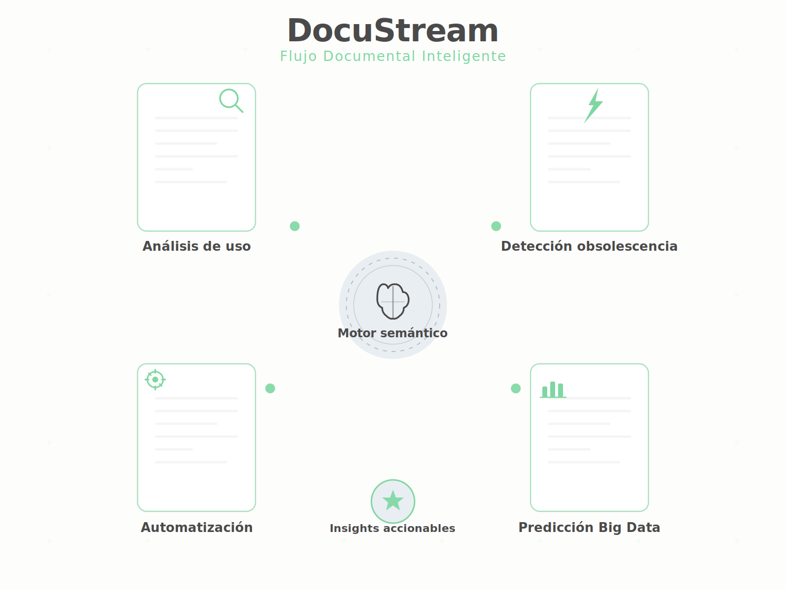

# 🚀 DocuStream — Intelligent Technical Documentation

Transforming complex technical documents into **structured, visual and actionable knowledge** using AI-driven processing, semantic graphs and interactive visualization.

---

## 🌐 Languages
**ES | [EN](index-en.html)**

---

## 🧠 What is DocuStream?

DocuStream is a conceptual prototype that demonstrates how technical documentation can be transformed into:

- Semantic knowledge graphs  
- Automated insights  
- Interactive visual layers  
- Smart document workflows  

Designed as a **portfolio project** by **Marisa Lozano Arroyo**, combining:

- Technical documentation expertise  
- Data analytics  
- Information architecture  
- Innovation & deeptech mindset  

---

## ✨ Key Features

### 🔍 Intelligent Processing
Automated extraction of entities, relationships and metadata.

### 🧩 Semantic Graphs
Visual representation of document structure and meaning.

### 📊 Advanced Visualization
Interactive diagrams, dynamic nodes and animated flows.

### ⚙️ Automation
Document workflows, classification and enrichment.

---

## 🖥️ Live Demo

### ▶️ **PRO Interactive Demo**
Explore the dynamic node graph with zoom, pan and real‑time movement:

👉 `docustream-pro.html`

Includes:
- Dynamic nodes  
- Intelligent connections  
- Zoom & pan  
- Dark mode  
- Reset & random generation  

---

## 🎨 UI & UX

The interface includes:

- Responsive layout  
- Premium hero section  
- Mobile menu with overlay  
- Smooth GSAP animations  
- Scroll reveal  
- Dark mode (persistent)  
- Clean, modern visual identity  

---

## 📁 Project Structure

